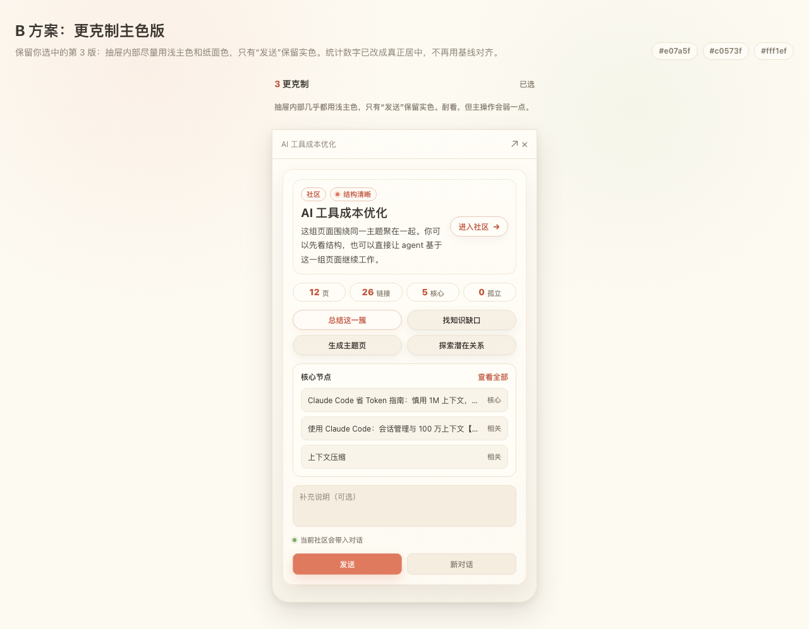

# Community Drawer Visual Standard Implementation Plan

> **For agentic workers:** REQUIRED SUB-SKILL: Use superpowers:subagent-driven-development (recommended) or superpowers:executing-plans to implement this plan task-by-task. Steps use checkbox (`- [ ]`) syntax for tracking.

**Goal:** Make the graph community drawer and graph selection drawer fully match the approved restrained main-color visual standard.

**Architecture:** Keep the existing shared `GraphGroupDrawer` as the single rendering surface for both community and selection drawers. Move the existing tag data into the top metadata row, keep all existing callbacks and view-model data unchanged, and use scoped CSS overrides under `.graph-group-drawer` so node/search/global summary drawers do not inherit the new compact stat treatment.

**Tech Stack:** React 19, TypeScript, Vite, CSS custom properties in `workbench/web/src/index.css`, Node built-in `node:test`, React server-side static markup tests, Playwright/manual browser verification through the local app.

---

## Approved Visual Baseline

This plan has one approved visual target. Implementation must compare against it before writing code, after CSS lands, and during browser verification.



Authoritative references:

- Approved screenshot: `docs/superpowers/plans/community-drawer-visual-standard-reference.png`
- Approved mock source: `designs/community-drawer-visual-options/index.html`
- Approved mock URL while the design server is running: `http://localhost:4311/community-drawer-visual-options/index.html`
- Approved design spec: `docs/superpowers/specs/2026-06-30-community-drawer-visual-standard-design.md`

Hard visual gates:

- Top metadata chips must sit above the stats row and include the drawer kind plus status chip.
- Stats must be one-line centered pills, not two-line cards.
- Recommended actions must use restrained light paper/accent color, not solid accent and not a pink-looking block.
- `发送` must be the only solid accent button inside the group drawer.
- Community and selection drawers must match the same visual system, with only the allowed content differences from the spec.
- Default-width and narrow drawers must not overlap text. Check at the normal 420px drawer width and after narrowing the drawer to about 360px.

## File Structure

- Modify: `workbench/web/src/components/GraphGroupDrawer.tsx`
  - Responsibility: Shared markup for community and selection group drawers.
  - Planned change: Move `view.tags` next to `view.kicker` in a top metadata row, wrap title/description/enter button in a hero area, keep facts/actions/nodes/dialogue behavior unchanged.

- Modify: `workbench/web/src/index.css`
  - Responsibility: App visual system and drawer styles.
  - Planned change: Scope the approved visual treatment to `.graph-group-drawer`, including top chips, hero area, compact centered stat pills, light action pills, and the lightweight enter-community button.

- Modify: `workbench/web/test/right-drawer-graph-summary.test.tsx`
  - Responsibility: Server-rendered contract tests for graph summary drawers.
  - Planned change: Assert community drawer metadata placement, centered stat CSS contract, restrained action styling, and that existing actions still render.

- Modify: `workbench/web/test/right-drawer-graph-selection.test.tsx`
  - Responsibility: Server-rendered contract tests for the graph selection drawer.
  - Planned change: Assert selection drawer uses the same top metadata row and the same group-drawer skeleton, without an enter-community button.

- No changes: `workbench/web/src/lib/graph-group-drawer.ts`
  - Existing `kicker`, `tags`, `facts`, `actions`, `nodes`, `dialogueHint`, and `nodeListExpandable` already contain the data needed for this visual standard.

## Task 1: Lock the Shared Drawer Markup and CSS Contract

**Files:**
- Modify: `workbench/web/test/right-drawer-graph-summary.test.tsx`
- Modify: `workbench/web/test/right-drawer-graph-selection.test.tsx`

- [ ] **Step 0: Load the approved visual baseline**

Open the baseline image before editing tests:

```text
docs/superpowers/plans/community-drawer-visual-standard-reference.png
```

Expected visual facts to keep in mind while writing tests:

```text
Top row has compact chips.
Stats are one-line centered pills.
Recommended action is light, not solid.
The send button is the only solid accent button.
The drawer feels warm-paper and restrained, not pink.
```

- [ ] **Step 1: Add community drawer metadata assertions**

In `workbench/web/test/right-drawer-graph-summary.test.tsx`, inside the test named `renders unified community drawer with overview, fixed actions, core nodes, and dialogue controls`, add these assertions after the existing `assert.match(html, /Alpha community/);` line:

```tsx
		assert.match(html, /graph-group-meta-row/);
		assert.match(html, /graph-group-meta-row[\s\S]*graph-summary-kicker[^>]*>社区<\/span>/);
		assert.match(html, /graph-group-meta-row[\s\S]*graph-group-status-chip[^>]*>结构清晰<\/span>/);
		assert.match(html, /graph-group-hero[\s\S]*graph-group-enter[^>]*>进入社区<\/button>/);
```

- [ ] **Step 2: Add group stat visual contract assertions**

In `workbench/web/test/right-drawer-graph-summary.test.tsx`, inside the test named `keeps the graph group drawer visual contract`, add these assertions after the existing `assert.match(css, /\.graph-group-node-toggle[\s\S]*color:\s*var\(--app-accent-deep\)/);` line:

```tsx
		assert.match(css, /\.graph-group-drawer \.graph-summary-facts[\s\S]*grid-template-columns:\s*repeat\(4,\s*minmax\(0,\s*1fr\)\)/);
		assert.match(css, /\.graph-group-drawer \.graph-summary-fact[\s\S]*display:\s*inline-flex/);
		assert.match(css, /\.graph-group-drawer \.graph-summary-fact[\s\S]*align-items:\s*center/);
		assert.match(css, /\.graph-group-drawer \.graph-summary-fact[\s\S]*justify-content:\s*center/);
		assert.match(css, /\.graph-group-drawer \.graph-summary-fact strong,\n  \.graph-group-drawer \.graph-summary-fact span[\s\S]*display:\s*inline-flex/);
		assert.match(css, /\.graph-group-status-chip::before[\s\S]*background:\s*var\(--app-accent\)/);
		assert.match(css, /\.graph-group-enter[\s\S]*border-radius:\s*999px/);
		assert.match(css, /\.graph-group-action\[data-recommended="true"\][\s\S]*background:\s*color-mix\(in srgb, var\(--app-accent-soft\) 72%, var\(--app-raised\)\)/);
		assert.doesNotMatch(css, /\.graph-group-action\[data-recommended="true"\][\s\S]{0,260}background:\s*var\(--app-accent\)/);
		assert.doesNotMatch(css, /\.graph-group-enter[\s\S]{0,260}background:\s*var\(--app-accent\)/);
		assert.match(css, /\.graph-group-drawer[\s\S]*container-type:\s*inline-size/);
		assert.match(css, /@container \(max-width:\s*380px\)[\s\S]*\.graph-group-hero-row[\s\S]*grid-template-columns:\s*1fr/);
```

- [ ] **Step 3: Add selection drawer metadata assertions**

In `workbench/web/test/right-drawer-graph-selection.test.tsx`, inside the test named `renders multi-node selections through the same group drawer skeleton`, add these assertions after the existing `assert.match(html, /选区/);` line:

```tsx
		assert.match(html, /graph-group-meta-row/);
		assert.match(html, /graph-group-meta-row[\s\S]*graph-summary-kicker[^>]*>选区<\/span>/);
		assert.match(html, /graph-group-meta-row[\s\S]*graph-group-status-chip[^>]*>Shift\+点击增删节点<\/span>/);
		assert.doesNotMatch(html, /graph-group-enter/);
```

- [ ] **Step 4: Run focused tests and verify they fail for the missing markup/CSS**

Run:

```bash
npm run test -w @llm-wiki-agent/web -- right-drawer-graph-summary.test.tsx right-drawer-graph-selection.test.tsx
```

Expected result:

```text
not ok
```

The failure should mention at least one of these missing strings or CSS selectors:

```text
graph-group-meta-row
graph-group-status-chip
grid-template-columns: repeat(4, minmax(0, 1fr))
```

- [ ] **Step 5: Keep the failing contract tests uncommitted**

Do not commit this state. These tests are intentionally red until Tasks 2 and 3 land.

Run:

```bash
git diff -- workbench/web/test/right-drawer-graph-summary.test.tsx workbench/web/test/right-drawer-graph-selection.test.tsx
```

Expected result:

```text
The diff contains only the new contract assertions from this task.
```

## Task 2: Move Tags Into the Top Metadata Row

**Files:**
- Modify: `workbench/web/src/components/GraphGroupDrawer.tsx`

- [ ] **Step 1: Replace the overview markup in `GraphGroupDrawer`**

In `workbench/web/src/components/GraphGroupDrawer.tsx`, replace the current block that starts with:

```tsx
				<div className="graph-group-overview">
```

and ends immediately before:

```tsx
				<div className="graph-group-action-grid">
```

with this block:

```tsx
				<div className="graph-group-overview">
					<div className="graph-group-hero">
						<div className="graph-group-meta-row">
							<span className="graph-summary-kicker">{view.kicker}</span>
							{view.tags.map((tag) => (
								<span key={tag} className="graph-summary-community-chip graph-group-status-chip">{tag}</span>
							))}
						</div>
						<div className="graph-group-hero-row">
							<div className="graph-group-overview-main">
								<h2 className="graph-summary-title">{view.title}</h2>
								{view.description && <p className="graph-summary-excerpt">{view.description}</p>}
							</div>
							{enterCommand && (
								<button
									type="button"
									className="graph-group-enter"
									onClick={() => onCommand?.(enterCommand)}
								>
									{enterCommand.label}
								</button>
							)}
						</div>
					</div>
					<div className="graph-summary-facts">
						{view.facts.map((fact) => (
							<div className="graph-summary-fact" key={fact.label}>
								<strong>{fact.value}</strong>
								<span>{fact.label}</span>
							</div>
						))}
					</div>
				</div>
```

This keeps the same `view.tags`, `view.facts`, `enterCommand`, and callbacks. It only changes their visual order.

- [ ] **Step 2: Remove the old tag block**

Confirm the old block below the facts has been removed from `workbench/web/src/components/GraphGroupDrawer.tsx`:

```tsx
						{view.tags.length > 0 && (
							<div className="graph-group-tags">
								{view.tags.map((tag) => (
									<span key={tag} className="graph-summary-community-chip">{tag}</span>
								))}
							</div>
						)}
```

After this step, `view.tags` must render only inside `.graph-group-meta-row`.

- [ ] **Step 3: Run focused tests and verify only CSS contract remains failing**

Run:

```bash
npm run test -w @llm-wiki-agent/web -- right-drawer-graph-summary.test.tsx right-drawer-graph-selection.test.tsx
```

Expected result:

```text
not ok
```

The markup assertions for these strings should now pass:

```text
graph-group-meta-row
graph-group-status-chip
graph-group-hero
```

Remaining failures should point to CSS contract assertions such as centered stat pills or recommended action color.

- [ ] **Step 4: Keep the markup change uncommitted until CSS passes**

Do not commit this state. The markup assertions should pass, but the CSS contract is still intentionally red until Task 3 lands.

Run:

```bash
git diff -- workbench/web/src/components/GraphGroupDrawer.tsx
```

Expected result:

```text
The diff only reorders existing group-drawer information into the approved top metadata layout.
```

## Task 3: Apply the Approved Visual Standard in CSS

**Files:**
- Modify: `workbench/web/src/index.css`

- [ ] **Step 0: Enable drawer-local responsive checks**

In `workbench/web/src/index.css`, add `container-type: inline-size;` to the existing `.graph-group-drawer` rule:

```css
  .graph-group-drawer {
    display: flex;
    flex-direction: column;
    container-type: inline-size;
    gap: 14px;
    border-radius: 16px;
    border: 1px solid rgba(94, 72, 48, 0.14);
    background: var(--paper-grain), rgba(255, 252, 246, 0.94);
    box-shadow: var(--shadow-lg);
    padding: 18px;
  }
```

This lets the drawer respond to its own width instead of the full browser viewport.

- [ ] **Step 1: Replace the group overview styles**

In `workbench/web/src/index.css`, replace the existing `.graph-group-overview` and `.graph-group-overview-main` rules with:

```css
  .graph-group-overview {
    display: grid;
    gap: 13px;
  }

  .graph-group-hero {
    display: grid;
    gap: 10px;
    padding: 12px;
    border: 1px solid color-mix(in srgb, var(--app-border) 76%, transparent);
    border-radius: 14px;
    background: linear-gradient(180deg, color-mix(in srgb, var(--app-surface) 76%, transparent), color-mix(in srgb, var(--app-bg) 46%, transparent));
  }

  .graph-group-meta-row {
    display: flex;
    flex-wrap: wrap;
    align-items: center;
    gap: 6px;
  }

  .graph-group-hero-row {
    display: grid;
    grid-template-columns: minmax(0, 1fr) auto;
    align-items: center;
    gap: 12px;
  }

  .graph-group-overview-main {
    display: grid;
    min-width: 0;
    gap: 7px;
  }
```

- [ ] **Step 2: Add top chip and description overrides**

In `workbench/web/src/index.css`, place these rules after `.graph-group-overview-main`:

```css
  .graph-group-meta-row .graph-summary-kicker,
  .graph-group-status-chip {
    display: inline-flex;
    min-height: 22px;
    align-items: center;
    gap: 6px;
    padding: 0 8px;
    border: 1px solid color-mix(in srgb, var(--app-accent) 28%, var(--app-border));
    border-radius: 999px;
    background: color-mix(in srgb, var(--app-surface) 86%, var(--app-accent-soft));
    color: var(--app-accent-deep);
    font-size: 11px;
    font-weight: 850;
    line-height: 1;
    white-space: nowrap;
  }

  .graph-group-status-chip::before {
    width: 6px;
    height: 6px;
    flex: 0 0 auto;
    border-radius: 999px;
    background: var(--app-accent);
    box-shadow: 0 0 0 3px color-mix(in srgb, var(--app-accent) 14%, transparent);
    content: "";
  }

  .graph-group-hero .graph-summary-excerpt {
    padding: 0;
    border: 0;
    border-radius: 0;
    background: transparent;
    line-height: 1.72;
  }
```

- [ ] **Step 3: Replace the shared group button base styles**

In `workbench/web/src/index.css`, replace the current `.graph-group-enter, .graph-group-action` rule and the related hover rule with:

```css
  .graph-group-enter,
  .graph-group-action {
    display: inline-flex;
    align-items: center;
    justify-content: center;
    gap: 7px;
    min-height: 32px;
    border: 1px solid color-mix(in srgb, var(--app-border) 78%, transparent);
    border-radius: 999px;
    background: color-mix(in srgb, var(--app-raised) 82%, transparent);
    color: var(--app-fg);
    font-size: 12px;
    font-weight: 820;
    line-height: 1.2;
    box-shadow: var(--shadow);
  }

  .graph-group-enter {
    flex: 0 0 auto;
    min-height: 32px;
    padding: 0 12px;
    border-color: color-mix(in srgb, var(--app-accent) 24%, var(--app-border));
    background: var(--app-surface);
    color: var(--app-accent-deep);
    box-shadow: inset 0 1px 0 color-mix(in srgb, white 58%, transparent), 0 5px 13px color-mix(in srgb, var(--app-shadow) 10%, transparent);
  }

  .graph-group-enter::after {
    color: currentColor;
    content: "→";
    font-weight: 900;
    transform: translateY(-0.5px);
  }

  .graph-group-enter:hover,
  .graph-group-action:hover {
    border-color: color-mix(in srgb, var(--app-accent) 34%, var(--app-border));
    background: color-mix(in srgb, var(--app-raised) 92%, var(--app-accent-soft));
  }
```

- [ ] **Step 4: Replace group action grid and recommended action styles**

In `workbench/web/src/index.css`, keep `.graph-group-action-grid` as a two-column grid and set these exact rules:

```css
  .graph-group-action-grid {
    display: grid;
    grid-template-columns: repeat(2, minmax(0, 1fr));
    gap: 8px;
  }

  .graph-group-action[data-recommended="true"] {
    border-color: color-mix(in srgb, var(--app-accent) 34%, var(--app-border));
    background: color-mix(in srgb, var(--app-accent-soft) 72%, var(--app-raised));
    color: var(--app-accent-deep);
    box-shadow: inset 0 1px 0 color-mix(in srgb, white 54%, transparent), 0 4px 10px color-mix(in srgb, var(--app-accent) 8%, transparent);
  }
```

This intentionally avoids `background: var(--app-accent)` for recommended actions.

- [ ] **Step 5: Add compact centered stat-pill overrides**

In `workbench/web/src/index.css`, place these scoped rules after the general `.graph-summary-fact span` rule and before `.graph-summary-meta, .graph-summary-actions`:

```css
  .graph-group-drawer .graph-summary-facts {
    display: grid;
    grid-template-columns: repeat(4, minmax(0, 1fr));
    gap: 6px;
  }

  .graph-group-drawer .graph-summary-fact {
    display: inline-flex;
    min-width: 0;
    min-height: 30px;
    align-items: center;
    justify-content: center;
    gap: 4px;
    padding: 0 8px;
    border: 1px solid var(--app-border);
    border-radius: 999px;
    background: color-mix(in srgb, var(--app-surface) 76%, transparent);
    color: var(--app-muted);
    line-height: 1;
  }

  .graph-group-drawer .graph-summary-fact strong,
  .graph-group-drawer .graph-summary-fact span {
    display: inline-flex;
    align-items: center;
    margin: 0;
    line-height: 1;
  }

  .graph-group-drawer .graph-summary-fact strong {
    color: var(--app-accent-deep);
    font-size: 14px;
  }

  .graph-group-drawer .graph-summary-fact span {
    color: var(--app-muted);
    font-size: 11px;
    transform: translateY(0.5px);
  }
```

- [ ] **Step 6: Add narrow-drawer safeguards**

In `workbench/web/src/index.css`, place this container query after the group stat overrides:

```css
  @container (max-width: 380px) {
    .graph-group-hero-row {
      grid-template-columns: 1fr;
    }

    .graph-group-enter {
      justify-self: start;
    }

    .graph-group-drawer .graph-summary-facts {
      gap: 4px;
    }

    .graph-group-drawer .graph-summary-fact {
      padding: 0 5px;
    }

    .graph-group-drawer .graph-summary-fact strong {
      font-size: 13px;
    }
  }
```

This preserves the approved 420px layout while preventing the title, enter button, and stat pills from colliding when the drawer is narrowed.

- [ ] **Step 7: Remove the obsolete `.graph-group-tags` styling**

In `workbench/web/src/index.css`, delete the old `.graph-group-tags` rule:

```css
  .graph-group-tags {
    display: flex;
    flex-wrap: wrap;
    gap: 6px;
  }
```

The tags now render inside `.graph-group-meta-row`.

- [ ] **Step 8: Run focused tests and verify they pass**

Run:

```bash
npm run test -w @llm-wiki-agent/web -- right-drawer-graph-summary.test.tsx right-drawer-graph-selection.test.tsx
```

Expected result:

```text
ok
```

- [ ] **Step 9: Commit the complete passing visual standard**

Run:

```bash
git add workbench/web/src/components/GraphGroupDrawer.tsx workbench/web/src/index.css workbench/web/test/right-drawer-graph-summary.test.tsx workbench/web/test/right-drawer-graph-selection.test.tsx
git commit -m "style: apply graph group drawer visual standard"
```

## Task 4: Verify Existing Behavior Did Not Move

**Files:**
- No source changes expected.

- [ ] **Step 1: Run group drawer view-model tests**

Run:

```bash
npm run test -w @llm-wiki-agent/web -- graph-group-drawer.test.ts
```

Expected result:

```text
ok
```

This confirms the implementation did not change `kicker`, `tags`, `facts`, actions, recommendations, node-list expansion flags, or prompt dispatch rules.

- [ ] **Step 2: Run drawer interaction tests**

Run:

```bash
npm run test -w @llm-wiki-agent/web -- right-drawer-interactions.test.tsx
```

Expected result:

```text
ok
```

This confirms sending, new-conversation dispatch, node selection, and drawer callbacks still work.

- [ ] **Step 3: Run all web tests**

Run:

```bash
npm run test -w @llm-wiki-agent/web
```

Expected result:

```text
ok
```

- [ ] **Step 4: Run lint**

Run:

```bash
npm run lint -w @llm-wiki-agent/web
```

Expected result:

```text
0 errors
```

- [ ] **Step 5: Commit verification-only fixes if any were needed**

If a previous verification step required a test or source adjustment, commit only those adjusted files:

```bash
git add workbench/web/src/components/GraphGroupDrawer.tsx workbench/web/src/index.css workbench/web/test/right-drawer-graph-summary.test.tsx workbench/web/test/right-drawer-graph-selection.test.tsx
git commit -m "fix: preserve graph group drawer behavior"
```

If no files changed after Task 3, skip this commit step and record that there were no verification fixes.

## Task 5: Browser Visual Verification

**Files:**
- No source changes expected unless browser verification exposes a visual mismatch.

- [ ] **Step 1: Start the app**

Run from the repository root:

```bash
npm run dev
```

Expected result:

```text
@llm-wiki-agent/server
@llm-wiki-agent/web
Local: http://localhost:5180/
```

Keep this process running for the browser checks.

If `localhost:5180` is already running, reuse the existing app server. If the port is occupied by a stale process and the app does not load, stop that process and rerun `npm run dev`; do not silently switch to another frontend port because this project uses a strict frontend port.

- [ ] **Step 2: Open the app in a browser**

Open:

```text
http://localhost:5180/
```

Expected page state:

```text
The llm-wiki-agent app loads, the current knowledge base is visible, and the graph tab can be opened.
```

- [ ] **Step 3: Verify a normal community drawer**

In the graph tab, click a normal community with an `进入社区` command.

Expected visual state:

```text
The drawer top card shows "社区" and "结构清晰" in the same top chip row.
"进入社区" is a light outlined pill on the right side of the hero area.
Stats render as one row of four equal pills.
Each stat pill centers the number and label horizontally and vertically.
"总结这一簇" is lightly emphasized, not a solid accent block.
"发送" is the only solid accent button.
```

Expected behavior state:

```text
Core node hover still previews on the graph.
Core node click still opens a node summary.
Typing in the textarea enables "发送".
```

- [ ] **Step 4: Verify the selection drawer**

Create a multi-node selection by Shift-clicking at least two graph nodes, or use a neighbor selection from a node command.

Expected visual state:

```text
The drawer top card shows "选区" and "Shift+点击增删节点" in the same top chip row.
No "进入社区" button is present.
Stats render as one row of four equal centered pills.
The action grid, node section, textarea, context hint, "发送", and "新对话" visually match the community drawer standard.
```

Expected behavior state:

```text
Typing in the textarea enables "发送".
"新对话" remains clickable.
The drawer still says "当前选区会带入对话".
```

- [ ] **Step 5: Compare against the approved mock**

Open the tracked approved screenshot and the mock reference:

```text
docs/superpowers/plans/community-drawer-visual-standard-reference.png
```

```text
http://localhost:4311/community-drawer-visual-options/index.html
```

Compare the live app drawer to the tracked screenshot first. Use the mock URL only as a secondary check for spacing and live scaling. If port `4311` is not running, skip the mock URL and use the tracked screenshot as the source of truth.

Required match:

```text
Warm paper background.
Restrained orange-red main color.
No pink-looking recommended action block.
Top status moved above the stats.
Stats no longer use two lines.
Stats are visually centered in their pills.
```

- [ ] **Step 6: Verify narrow drawer layout**

Resize the right drawer from its normal width to about 360px.

Required match:

```text
The hero title and "进入社区" do not overlap.
The top chips wrap cleanly if needed.
The four stat pills remain a single row.
Numbers and labels stay readable.
No button text clips or spills outside its pill.
```

- [ ] **Step 7: Capture screenshots for final review**

Capture screenshots of:

```text
1. Normal community drawer.
2. Selection drawer.
```

Use Playwright or the browser screenshot tool. Save screenshots under:

```text
designs/community-drawer-visual-options/live-community.png
designs/community-drawer-visual-options/live-selection.png
```

Do not stage these screenshots unless the user asks to keep them in git.

- [ ] **Step 8: Commit browser-discovered visual fixes if needed**

If visual verification exposed a mismatch, adjust only `workbench/web/src/components/GraphGroupDrawer.tsx` or `workbench/web/src/index.css`, rerun the focused tests, and commit:

```bash
npm run test -w @llm-wiki-agent/web -- right-drawer-graph-summary.test.tsx right-drawer-graph-selection.test.tsx
git add workbench/web/src/components/GraphGroupDrawer.tsx workbench/web/src/index.css workbench/web/test/right-drawer-graph-summary.test.tsx workbench/web/test/right-drawer-graph-selection.test.tsx
git commit -m "fix: match approved graph group drawer visual"
```

If no files changed after browser verification, skip this commit step and record that the browser check passed without extra fixes.

## Task 6: Final Pre-Push Readiness Check

**Files:**
- No source changes expected.

- [ ] **Step 1: Check git status**

Run:

```bash
git status --short --branch
```

Expected result:

```text
## codex/fix-community-drawer-visuals
```

Untracked design artifacts may still appear:

```text
?? designs/community-drawer-visual-options/
?? designs/pr82-drawer-recovery/
?? tests/fixtures/graph-interactive-unified-drawer/
```

Do not stage unrelated untracked paths.

- [ ] **Step 2: Review the final diff**

Run:

```bash
git diff main...HEAD -- workbench/web/src/components/GraphGroupDrawer.tsx workbench/web/src/index.css workbench/web/test/right-drawer-graph-summary.test.tsx workbench/web/test/right-drawer-graph-selection.test.tsx docs/superpowers/specs/2026-06-30-community-drawer-visual-standard-design.md docs/superpowers/plans/2026-06-30-community-drawer-visual-standard.md
```

Expected review outcome:

```text
Diff contains only visual/layout changes, tests, the approved spec, and this implementation plan.
No graph engine, prompt construction, API, or data-source files changed.
```

- [ ] **Step 3: Run the project quick check required before push**

Run:

```bash
bash install.sh --dry-run --platform codex
```

Expected result:

```text
dry-run completes without an error exit
```

- [ ] **Step 4: Run the privacy leak check required before push**

Run:

```bash
grep -r '本机用户路径\|真实姓名\|私有素材路径' scripts/ templates/ tests/ SKILL.md
```

Expected result:

```text
No matches
```

- [ ] **Step 5: Prepare final implementation summary**

Write a short final summary for the user covering:

```text
1. Community and selection drawers now share one visual standard.
2. "结构清晰" and equivalent status chips moved to the top row.
3. Stats are one-line centered pills.
4. Recommended actions use restrained light color; "发送" remains the only solid main button.
5. Browser verification and tests passed.
```

## Engineering Review Addendum

Review date: 2026-06-30
Review target: current branch diff, including this plan and `docs/superpowers/specs/2026-06-30-community-drawer-visual-standard-design.md`

### Step 0 Scope Challenge

Scope accepted as-is after hardening. The plan touches the right files for the goal:

```text
GraphGroupDrawer.tsx  -> reorder existing shared drawer content only
index.css             -> visual system and layout rules only
right-drawer tests    -> lock visible contract and behavior boundaries
browser verification  -> compare live drawers against approved baseline
```

No new data source, graph engine path, prompt path, API, dependency, or product feature is needed. The plan remains under the complexity smell threshold: four implementation files, no new services, no new classes.

### What Already Exists

- `GraphGroupDrawer` already serves both community and selection drawers. The plan reuses it instead of making separate community and selection components.
- `graph-group-drawer.ts` already provides `kicker`, `tags`, `facts`, `actions`, `nodes`, `dialogueHint`, and expansion flags. The plan keeps this data model unchanged.
- Existing right-drawer tests already cover rendering, send disabled/enabled state, node toggles, icons, and key CSS contracts. The plan extends these tests instead of adding a parallel test harness.
- Existing app theme tokens already define the accepted color family. The plan uses those tokens instead of introducing a new palette.

### NOT In Scope

- Graph canvas rendering, nodes, edges, Sigma interactions, and community detection are not in scope because this is a drawer-only visual pass.
- Prompt construction, agent dispatch, send/new-conversation behavior, and community-enter navigation are not in scope because the user explicitly requested no functional changes.
- Node summary, search result summary, global overview, loading, and error drawers are not in scope because the approved visual target is the shared group drawer only.
- Committing generated live verification screenshots is not in scope unless the user asks for them; the tracked approved baseline screenshot is the stable review artifact.
- Starting or maintaining the standalone design server on port `4311` is not required; the tracked approved screenshot is the primary baseline.

### Architecture Review

No blocking architecture issues remain. The main risk was that implementation could drift from the approved visual target if the plan relied only on prose or a local mock URL. This is now fixed by adding a tracked approved screenshot and hard visual gates at the top of the plan.

Production failure scenario:

```text
Long title or narrow drawer
  -> title / enter button / stat pills collide
  -> user sees a broken drawer even though unit tests pass
  -> plan now requires drawer-local container safeguards and 360px browser verification
```

No ASCII diagram is needed in source code. The component flow is simple and the plan already names the only relevant data path.

### Code Quality Review

No unresolved code-quality issues remain. The original plan had one process smell: committing intentionally failing tests and partially complete markup. That is now fixed. The plan still uses red-green TDD, but commits only after the complete visual standard passes.

### Test Review

Coverage diagram:

```text
CODE PATHS                                             USER FLOWS
[+] GraphGroupDrawer shared render                      [+] Community drawer
  ├── [★★ TESTED] kind chip renders                        ├── [★★★ PLANNED] top chips + enter pill + stats
  ├── [★★ TESTED] status chip moves to top                 ├── [★★★ PLANNED] send enables after typing
  ├── [★★ TESTED] stats use inline centered pills          └── [★★★ PLANNED] narrow drawer no overlap
  ├── [★★ TESTED] recommended action stays light        [+] Selection drawer
  ├── [★★ TESTED] enter button absent for selection        ├── [★★★ PLANNED] same visual standard, no enter
  └── [★★★ TESTED] callbacks preserved by interaction tests└── [★★★ PLANNED] send/new conversation still usable

COVERAGE: planned coverage is complete for this visual/layout change.
QUALITY: ★★★ browser/user-flow checks + ★★ SSR/CSS contract checks.
```

The test plan now covers the real user-visible failure modes, not just string presence:

- approved screenshot comparison
- default and narrow drawer width
- community and selection variants
- solid-button boundary
- existing callback behavior

### Performance Review

No performance issues found. This plan adds static CSS and a small markup reorder. It does not add data fetching, graph computation, timers, observers, or new render loops.

### Failure Modes

| Failure mode | Covered by plan | User impact if missed |
|---|---|---|
| Stats visually regress to two-line cards | CSS contract + browser check | Drawer wastes vertical space again |
| Recommended action becomes pink or solid | CSS negative assertion + screenshot comparison | User sees the exact visual problem they rejected |
| `发送` stops being the only solid accent button | CSS assertions + browser check | Primary action hierarchy becomes muddy |
| Narrow drawer text overlaps | Container query + 360px browser check | Drawer looks broken after resize |
| Selection drawer keeps old style | selection SSR test + browser check | Community and selection drift into two standards |
| Callback behavior changes | existing interaction tests | User loses send/new conversation/node behavior |

No critical gaps remain.

### Outside Voice

Codex outside review found the plan was too string-test-heavy and needed stronger live visual gates, narrow-width handling, and a durable baseline artifact. Relevant points were absorbed into this plan:

- tracked approved screenshot added
- mock URL made secondary to the screenshot
- narrow drawer verification added
- container-query safeguard added
- solid-accent negative assertions added
- no-red-commit flow kept

Rejected or not applied:

- “Do not use subtask skill” is an execution preference, not a plan correctness issue. The user can still choose inline execution.
- “Add branch creation” is already satisfied in the current branch and is checked again in the final readiness task.
- “Prepare a clean fixture app route” would expand scope beyond this drawer visual pass; the existing SSR fixtures plus browser checks are enough.

No cross-model tension remains.

### Parallelization

Sequential implementation, no parallelization opportunity. The work centers on one shared component and one CSS region. Parallel worktrees would create avoidable merge conflicts in `GraphGroupDrawer.tsx`, `index.css`, and the same drawer tests.

### Implementation Tasks

Synthesized from this review's findings. The findings were folded directly into the plan above.

- [ ] **T1 (P2, human: ~30min / CC: ~5min)** — Plan baseline — Keep approved visual screenshot as the implementation gate
  - Surfaced by: Architecture review and Codex outside voice — plan needed a durable visual target, not just a mock URL.
  - Files: `docs/superpowers/plans/2026-06-30-community-drawer-visual-standard.md`, `docs/superpowers/plans/community-drawer-visual-standard-reference.png`
  - Verify: plan opens with `Approved Visual Baseline` and references the tracked screenshot.

- [ ] **T2 (P2, human: ~45min / CC: ~8min)** — Drawer layout — Add narrow-width and solid-button guardrails to the implementation plan
  - Surfaced by: Test review and Codex outside voice — default tests could pass while narrow drawers or button hierarchy still looked wrong.
  - Files: `docs/superpowers/plans/2026-06-30-community-drawer-visual-standard.md`
  - Verify: plan includes container query steps, 360px browser verification, and negative assertions for accidental solid accent buttons.

## GSTACK REVIEW REPORT

| Review | Trigger | Why | Runs | Status | Findings |
|--------|---------|-----|------|--------|----------|
| CEO Review | `/plan-ceo-review` | Scope & strategy | 0 | — | Not needed for this narrow visual/layout plan |
| Codex Review | `/codex review` | Independent 2nd opinion | 1 | ISSUES FOUND | Found visual-gate, narrow-width, and evidence-chain gaps; relevant fixes folded into plan |
| Eng Review | `/plan-eng-review` | Architecture & tests (required) | 1 | CLEAR | 2 issues found, 0 critical gaps, 0 unresolved decisions |
| Design Review | `/plan-design-review` | UI/UX gaps | 0 | — | Design already confirmed by user through visual mock iteration |
| DX Review | `/plan-devex-review` | Developer experience gaps | 0 | — | Not needed for this narrow UI implementation plan |

- **CODEX:** Outside voice found 12 concerns; visual-baseline, narrow-width, screenshot, solid-button, and port assumptions were folded into this plan.
- **CROSS-MODEL:** No unresolved disagreement. Both reviews agree the shared `GraphGroupDrawer` approach is the right scope.
- **VERDICT:** ENG CLEARED — ready to implement after the user chooses execution mode.
NO UNRESOLVED DECISIONS
